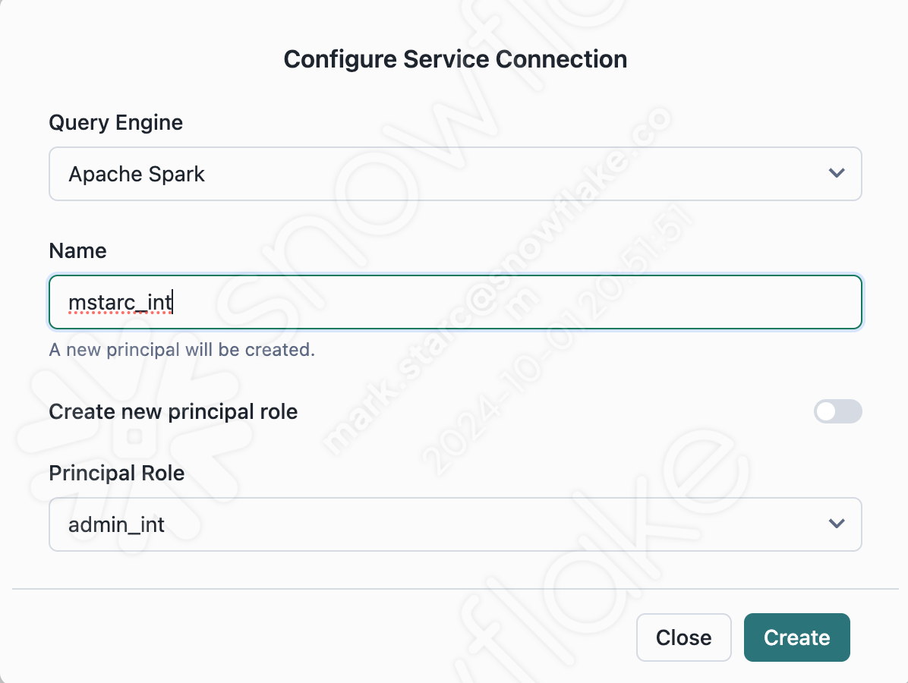

# Polaris and Iceberg Labs #  

### Prerequisites  ##  

- Anaconda
- Key-pair configured in CAS2 environment (LAB 4)

## Install Conda, Spark, Jupyter on your laptop ##  

To create the environment needed, run the following in your shell:  
`conda env create -f environment.yml`

## Log into the Polaris Catalog Web Interface ##  

https://app.snowflake.com/us-west-2/tzb93977/#/catalogs/apj_ps_tmup_ext  

User: `apj_admin`  
pw: `zdw6XCZ*gkj_efv4ebj`  

### Create a new connection for Apache Spark ### 

Create a new connection (client_id / client_secret pair) for Apache Spark to run queries against the catalog `apj_ps_tmup_int`. To create a connection, click the Connections tab in the left nav pane and click the +Connection button in the right corner.

While creating the connection, Set:  
 `Query Engine` = `Apache Spark`   
 `Name` = `<username>_int`  
 `Principal Role` = `admin_int`  

## Copy the client_id and client_secret and keep them in a safe place. ##   

##  Set up Spark ##  
From your terminal, run the following commands to activate the virtual environment you created in the setup, and open jupyter notebooks.  

`conda activate iceberg-lab`  
`jupyter notebook`  

Open `Step1.ipynb` in your notebook. Follow instructions in notebook.

