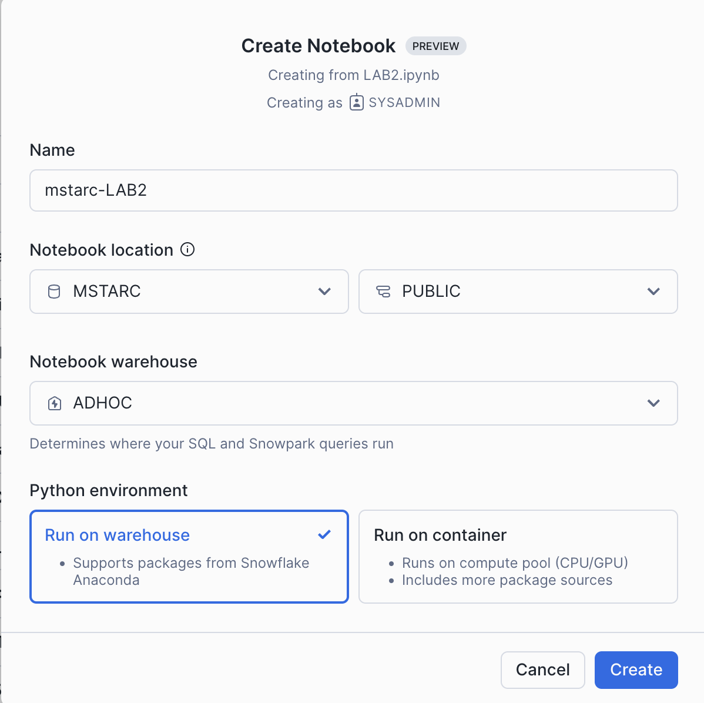
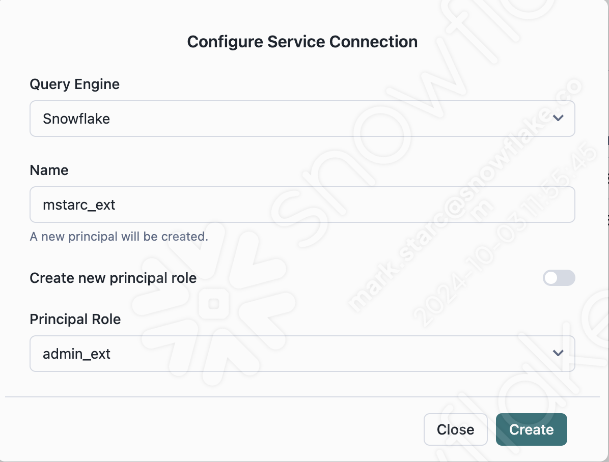
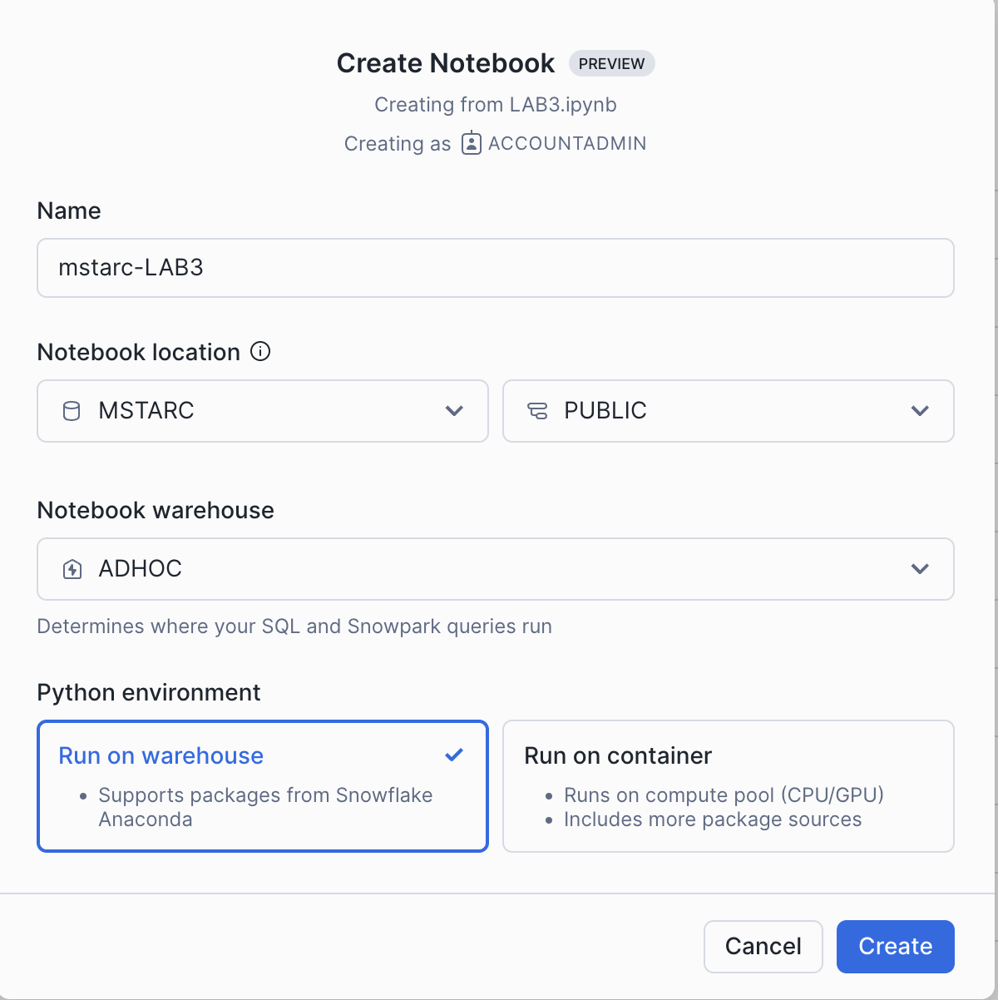

# Polaris and Iceberg Labs #  

### Prerequisites  ##  

- Anaconda

## LAB 1 ##  

## Install Conda, Spark, Jupyter on your laptop ##  

To create the environment needed, run the following in your shell:  
`conda env create -f environment.yml`

## Log into the Polaris Catalog Web Interface ##  

  
<a href="https://app.snowflake.com/us-west-2/tzb93977/#/catalogs/apj_ps_tmup_ext" target="_blank">https://app.snowflake.com/us-west-2/tzb93977/#/catalogs/apj_ps_tmup_ext</a>  

User: `apj_admin`  
pw: `zdw6XCZ*gkj_efv4ebj`  

### Create a new connection for Apache Spark ### 

Create a new connection (client_id / client_secret pair) for Apache Spark to run queries against the catalog `apj_ps_tmup_int`. To create a connection, click the Connections tab in the left nav pane and click the +Connection button in the right corner.

While creating the connection, Set:  
 `Query Engine` = `Apache Spark`   
 `Name` = `<username>_int`  
 `Principal Role` = `admin_int`  

## Copy the client_id and client_secret and keep them in a safe place. ##   

###  Set up Spark ###  
From your terminal, run the following commands:  

Find the file location of your virtual environment. You'll need this for the notebook.  
`conda env list | grep iceberg-lab-techup`  
Copy the file location i.e: `/Users/mstarc/anaconda3/envs/iceberg-lab-techup`

To activate the virtual environment you created in the setup, and open jupyter notebooks.  

`conda activate iceberg-lab-techup`  

`jupyter notebook`  

Open `LAB1.ipynb` in your notebook. Follow instructions in notebook.

Once you complete mo e onto lab 2.

## LAB 2 ##  

Login to Snowflake CAS2

Import the notebook LAB2.ipynb into Snowflake under Projects -> Notebooks and follow the instructions on reading your Polaris managed Iceberg table in Snowflake.

## LAB 3 ##  

## Log into the Polaris Catalog Web Interface ##  

<a href="https://app.snowflake.com/us-west-2/tzb93977/#/catalogs/apj_ps_tmup_ext" target="_blank">https://app.snowflake.com/us-west-2/tzb93977/#/catalogs/apj_ps_tmup_ext</a>  

User: `apj_admin`  
pw: `zdw6XCZ*gkj_efv4ebj`  

### Create a new connection for Snowflake ### 

Create a new connection (client_id / client_secret pair) for Snowflake to sync to the catalog `apj_ps_tmup_ext`. To create a connection, click the Connections tab in the left nav pane and click the +Connection button in the right corner.

While creating the connection, Set:  
 `Query Engine` = `Snowflake`   
 `Name` = `<username>_ext`  
 `Principal Role` = `admin_ext`  

## Copy the client_id and client_secret and keep them in a safe place. ##   

Login to Snowflake CAS2

Import the notebook LAB3.ipynb into Snowflake under Projects -> Notebooks and follow the instructions on reading your Polaris managed Iceberg table in Snowflake.

## LAB 4 ##  

Lab 4 will require either username & private key to access CAS2. 
If you haven't setup a private for your CAS2 login you can do so my following the following instructions <a href="https://docs.snowflake.com/en/user-guide/key-pair-auth#configuring-key-pair-authentication " target="_blank">Here</a> 

Once you have Key pair setup in CAS2 you can open `LAB4.ipynb` up in your Jupyter notebook session. You can start that session up again by running:

`conda activate iceberg-lab-techup`  

`jupyter notebook`  

## Further reading ##  

- Spark connection to Snowflake managed Iceberg tables, no Polaris. `SF_SPARK.ipynb` walks you through this. It requires a connection to Snowflake and the connection details to AWS.  

- <a href="https://quickstarts.snowflake.com/guide/getting_started_iceberg_tables/index.html#0" target="_blank">Getting Started with Iceberg Tables</a>  

- Compass <a href="https://snowflake.seismic.com/Link/Content/DCGph4qCF63RqG2PHTHdghHQBfRV" target="_blank">Polaris Catalog Compass page</a>  

- Compass <a href="https://snowflake.seismic.com/Link/Content/DCdRXbWT6DCDPGHJdHb4GW4Pg9JB" target="_blank">Iceberg Tables Compass page</a>  

- Slack  <a href="https://snowflake.enterprise.slack.com/archives/C034ELEETRA" target="_blank">#iceberg-snowflake</a>  

- Slack  <a href="https://snowflake.enterprise.slack.com/archives/C0742QN88G5" target="_blank">#apache-polaris-incubating</a>  

